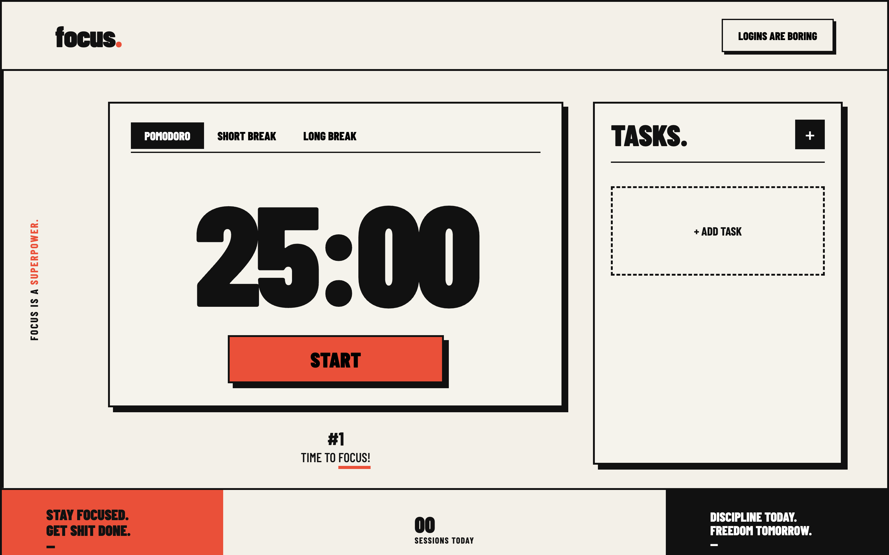

# focus.

A minimal, editorial-style Pomodoro timer built around **Editorial Neo-Brutalism**.

> **Focus is a superpower.**

The project combines a distraction-free Pomodoro timer with task management and a bold visual identity inspired by print/editorial design.

## Preview



The interface uses:

- Warm off-white paper background
- Near-black typography and borders
- Bright orange-red accent color
- Heavy `Barlow Condensed` display typography
- Thick borders and offset shadows
- Strong grid-based composition
- Editorial-style labels and statistics

## Features

### Pomodoro Timer
- 25-minute Pomodoro sessions
- 5-minute short breaks
- 15-minute long breaks
- Start / pause functionality
- Automatic timer reset after completion
- Session counter
- Browser tab title updates while the timer runs

### Tasks
- Add tasks
- Mark tasks as completed
- Delete tasks
- Empty-state task interface
- Tasks are managed directly in the browser

### Dashboard
- Session count
- Focus-time display
- Productivity indicator
- Current session indicator
- Editorial motivational messaging

### Responsive Design
The layout adapts to smaller screens while preserving the visual language and hierarchy of the desktop version.

## Design

The design direction is **Editorial Neo-Brutalism**.

The visual system intentionally uses:

```text
PAPER       → warm off-white
INK         → near-black
ACCENT      → orange-red
BORDERS     → thick black rules
SHADOWS     → hard offset shadows
TYPE        → condensed, heavy, editorial
```

The main display typeface is:

**Barlow Condensed**

The supporting interface typeface is:

**Inter**

Fonts are loaded from Google Fonts.

## Tech Stack

This version intentionally keeps the stack lightweight:

- HTML5
- CSS3
- Vanilla JavaScript
- Google Fonts
- No framework
- No build system
- No backend

## Project Structure

```text
pomofocus-editorial/
└── index.html
```

The current prototype is intentionally contained in a single HTML file so it can be opened and tested immediately.

## Getting Started

### Option 1 — Open directly

Download or clone the project and open:

```text
index.html
```

in your browser.

### Option 2 — Run a local server

Using Python:

```bash
python3 -m http.server 8000
```

Then open:

```text
http://localhost:8000
```

## How It Works

The timer is implemented with JavaScript's `setInterval()`.

The application maintains the remaining time in seconds:

```js
let seconds = 1500;
```

The timer converts the remaining seconds into minutes and seconds and updates the display every second.

Different modes change the initial duration:

```text
Pomodoro    25 minutes
Short Break 5 minutes
Long Break  15 minutes
```

## Customizing Timer Durations

Find the mode buttons in `index.html`:

```html
<button class="mode active" data-min="25">Pomodoro</button>
<button class="mode" data-min="5">Short Break</button>
<button class="mode" data-min="15">Long Break</button>
```

Change the `data-min` values to customize the durations.

For example:

```html
<button class="mode active" data-min="50">Pomodoro</button>
```

creates a 50-minute Pomodoro.

## Customizing the Theme

The primary design variables are defined at the top of the CSS:

```css
:root {
  --paper: #f3f0e8;
  --ink: #111;
  --accent: #ff4028;
  --line: 3px solid var(--ink);
  --shadow: 8px 8px 0 var(--ink);
}
```

These variables control most of the visual identity.

## Typography

The project uses:

```html
<link href="https://fonts.googleapis.com/css2?family=Barlow+Condensed:wght@500;600;700;800;900&family=Inter:wght@400;500;600;700;800&display=swap" rel="stylesheet">
```

`Barlow Condensed` is used for:

- Timer
- Headings
- Buttons
- Statistics
- Editorial labels
- Branding

`Inter` is used for supporting interface text.

## Roadmap

The current version is a functional front-end prototype. Possible future improvements include:

- [ ] LocalStorage persistence
- [ ] Persistent task list
- [ ] Completed-task history
- [ ] Configurable Pomodoro durations
- [ ] Configurable long-break interval
- [ ] Sound notifications
- [ ] Browser notifications
- [ ] Automatic break scheduling
- [ ] Daily focus statistics
- [ ] Weekly reports
- [ ] Productivity charts
- [ ] Dark mode
- [ ] Keyboard shortcuts
- [ ] Settings panel
- [ ] Sign-in / accounts
- [ ] Cloud synchronization
- [ ] PWA support
- [ ] Offline support

## Philosophy

The product is deliberately designed around one idea:

> **Remove friction between deciding to focus and actually focusing.**

The interface should feel like a physical editorial object rather than another generic productivity dashboard.

Less decoration.

More hierarchy.

More focus.

## License

This project is currently an experimental/personal project.

Add a license here if you intend to distribute the project publicly.
